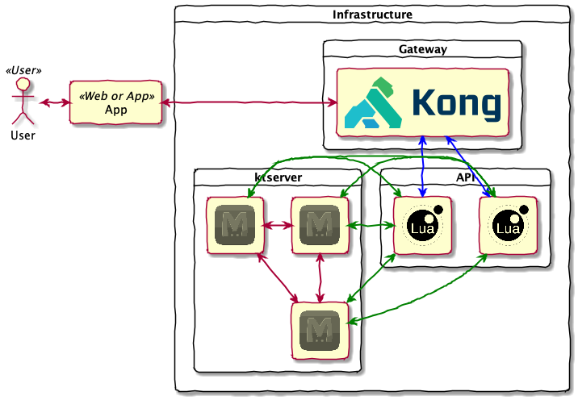
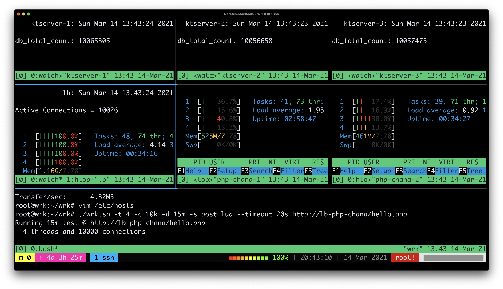

# Form Register API


## Tech Stack

- [Kong - API Gateway](https://github.com/kong/kong)
- [ngx_lua - API](https://github.com/openresty/lua-nginx-module)
- [ktserver - Database](https://dbmx.net/kyototycoon/command.html#ktserver)

## Architecture Design


## Deploy API

```
docker-compose up -d
```

## Register API

```
curl -i http://127.0.0.1/v1/register \
    -d '{"id":"1234", "name":"John Farmer", "phone":"0812345678", "address":"7th Heven"}'
```


## DB Report

```
docker exec kt1 ktremotemgr report -host kt1
```

## List Data

```
docker exec kt1 ktremotemgr list -host kt2 -pv
```

## Export Data

```
docker exec kt1 ktremotemgr list -host kt3 -pv > db.tsv
```

## Specification Recomend

> Minimum Spec for each server node

|   |   |
|----|----|
| **CPU** | 4 Core |
| **RAM** | 8 GB |
| **SSD** | 40 GB |
| **Network Bandwidth** | 1 Gbps |

## Load Testing Result



 Lua Script for wrk [wg/wrk/scripts/post.lua](https://github.com/wg/wrk/blob/master/scripts/post.lua)
## Known Issue

Please generate unique id for load testing and disable rate-limiting plugins in [conf.d/kong.yml](conf.d/kong.yml) before run load testing
