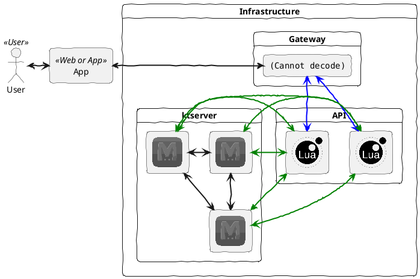

# Form Register API PoC


## Tech Stack

- [Kong - API Gateway](https://github.com/kong/kong)
- [ngx_lua - API](https://github.com/openresty/lua-nginx-module)
- [ktserver - Database](https://dbmx.net/kyototycoon/command.html#ktserver)

## Architecture Design



## Deploy API

```
docker-compose up -d
```

## Register API

```
curl -i http://127.0.0.1/v1/register\
    -d '{"id":"1234", "name":"John Farmer", "phone":"0812345678", "address":"7th Heven"}'
```


## DB report

```
docker exec kt1 ktremotemgr report -host kt1
```

## List Data

```
docker exec kt1 ktremotemgr list -host kt3 -pv
```

## Export Data

```
docker exec kt1 ktremotemgr list -host kt3 -pv > db.tsv
```

## Specification Recomemd

> Minimum Spec

|   |   |
|----|----|
| CPU | 4 Core |
| RAM | 8GB |
| SSD | 40GB |
| Network Bandwidth | 1Gbps |

## Load Testing Result


## Known Issue

Please generate unique id for load testing and disable rate-limiting plugins in [conf.d/kong.yml](conf.d/kong.yml) before run load testing
